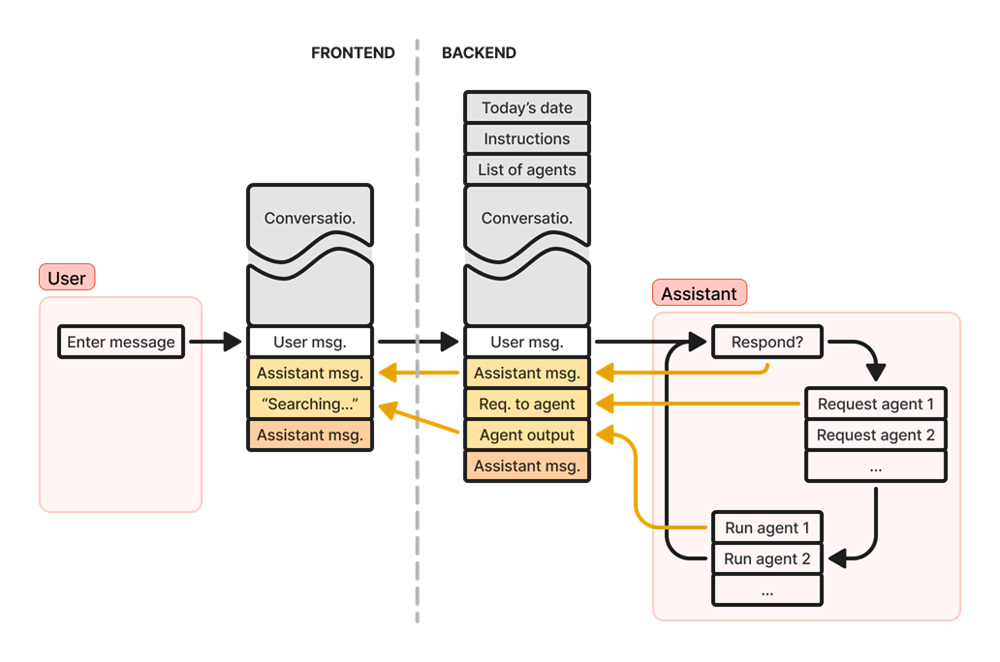

# iChatBio

A chatbot for [the iDigBio Portal](https://www.idigbio.org/portal) and other things.  

## Develop

Requirements:

```bash
sudo apt install postgresql
sudo apt install libpq-dev
```

Quick start:

```bash
git clone git@github.com:acislab/idigbio-chat
cd idigbio-chat
pip install virtualenv
virtualenv venv --python=python3.12
source venv/bin/activate
pip install -r requirements.txt
python3 backend/app.py
cp .env.template .env
```

Then fill out `.env` with all the secrets.

Here's a high-level overview of the system:



## Funding

This work is funded by grants from the National Science Foundation (DBI 2027654) and the AT&T Foundation.
